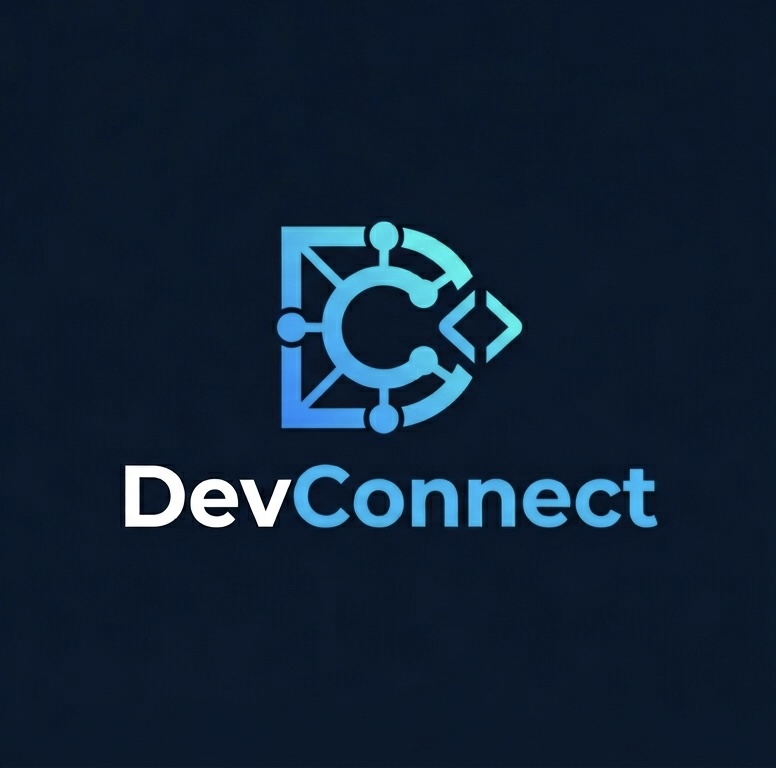

<div align="center">
  

  <h1>DevConnect — Web</h1>

  <p>
    <strong>EN:</strong> The open-source platform connecting developers to real projects.<br/>
    Find your team, apply in seconds, and start building.
  </p>

  <p>
    <strong>ES:</strong> La plataforma open-source que conecta desarrolladores con proyectos reales.<br/>
    Encuentra tu equipo, aplica en segundos y comienza a construir.
  </p>

  <p>
    <a href="https://github.com/M41k80/devconnect-web/blob/main/LICENSE"></a>
    <a href="https://nextjs.org"></a>
    <a href="https://www.typescriptlang.org"></a>
    <a href="https://tailwindcss.com"></a>
    <a href="https://github.com/M41k80/devconnect-web/stargazers"></a>
  </p>

  <p>
    <a href="https://devconnect.dev">Live Demo</a> ·
    <a href="https://github.com/M41k80/devconnect-api-nestjs">Backend Repository</a> ·
    <a href="docs/introduction.md">Documentation</a> ·
    <a href="https://discord.gg/5xEWnfJDjt">Discord</a>
  </p>
</div>

---

## Apóyame / Buy Me a Coffee

❤️ Apoya el crecimiento de DevConnect || ❤️ Support DevConnect's Growth

DevConnect nació con una misión clara: conectar el talento IT con proyectos reales de código abierto. Cada línea de código, desde el robusto backend hasta la interfaz, ha sido construida con dedicación para fortalecer nuestra comunidad.
Mantener y escalar una plataforma gratuita requiere tiempo y recursos. Si este proyecto te ha aportado valor, te ha ayudado a encontrar colaboradores o simplemente crees en nuestra visión, considera apoyarnos.
¿Eres una empresa? Conviértete en Sponsor para destacar tu marca ante una comunidad creciente de desarrolladores y profesionales del sector.


DevConnect was born with a clear mission: connecting IT talent with real world open source projects. Every line of code, from the solid backend to the UI, has been built with dedication to empower our community.
Running and scaling a free platform takes time and resources. If this project has provided value to you, helped you find collaborators, or you simply believe in our vision, please consider supporting us.
Are you a company? Become a Sponsor to showcase your brand to a growing community of developers and tech professionals.


[](https://www.buymeacoffee.com/m41k80)


-----

## 🧠 What is DevConnect? / ¿Qué es DevConnect?

**EN:**
DevConnect is an open-source developer collaboration platform. It bridges the gap between developers looking to contribute and open-source projects looking for contributors.

**ES:**
DevConnect es una plataforma open-source de colaboración para desarrolladores. Conecta a desarrolladores que buscan contribuir con proyectos open-source que necesitan colaboradores.

* **EN:** Developers discover projects that match their exact skills and role
  **ES:** Los desarrolladores descubren proyectos que coinciden con sus habilidades y rol

* **EN:** Project owners receive applications, review contributors, and build their team
  **ES:** Los propietarios reciben solicitudes, revisan contribuidores y construyen su equipo

* **EN:** Everyone collaborates through a transparent, community-driven platform
  **ES:** Todos colaboran en una plataforma transparente impulsada por la comunidad

**EN:**
This repository contains the **frontend** (Next.js). The backend (NestJS) lives at devconnect-api-nestjs.

**ES:**
Este repositorio contiene el **frontend** (Next.js). El backend (NestJS) está en devconnect-api-nestjs.

---

## ✨ Features / Características

| Feature                | Description                                                          | Característica             | Descripción                                         |
| ---------------------- | -------------------------------------------------------------------- | -------------------------- | --------------------------------------------------- |
| 🔍 Smart Discovery     | Projects ranked by skill match score — algorithm runs on the backend | Descubrimiento inteligente | Proyectos ordenados por coincidencia de habilidades |
| 📋 Project Listings    | Filter by status and tech stack                                      | Listado de proyectos       | Filtrado por estado y tecnologías                   |
| 🙋 Apply to Projects   | Send an application message; owners accept or reject                 | Aplicar a proyectos        | Enviar solicitudes fácilmente                       |
| 🔔 Dual Notifications  | Badge system for users                                               | Notificaciones             | Sistema de notificaciones                           |
| 👤 Developer Profiles  | Bio, skills, links                                                   | Perfiles                   | Perfil completo                                     |
| 🌐 i18n                | English / Spanish support                                            | i18n                       | Soporte bilingüe                                    |
| 🎨 Theme System        | Light / dark mode                                                    | Temas                      | Modo claro / oscuro                                 |
| 🔐 JWT Auth            | Secure auth system                                                   | Autenticación              | JWT seguro                                          |
| 📱 Fully Responsive    | Mobile-first                                                         | Responsive                 | Diseño adaptable                                    |
| 💬 Discord Integration | Community onboarding                                                 | Discord                    | Integración comunidad                               |

---

## 🛠️ Tech Stack / Tecnologías

| Layer           | Technology            | Capa        | Tecnología            |
| --------------- | --------------------- | ----------- | --------------------- |
| Framework       | Next.js 16            | Framework   | Next.js 16            |
| Language        | TypeScript 5          | Lenguaje    | TypeScript 5          |
| Styling         | Tailwind CSS v3       | Estilos     | Tailwind CSS          |
| State           | Zustand 5             | Estado      | Zustand               |
| Forms           | React Hook Form + Zod | Formularios | React Hook Form + Zod |
| HTTP            | Axios                 | HTTP        | Axios                 |
| Runtime         | Node.js 18+           | Entorno     | Node.js 18+           |
| Package manager | Yarn                  | Gestor      | Yarn                  |

---

## 📸 Screenshots / Capturas

**EN:** Screenshots coming soon.
**ES:** Capturas próximamente.

---

## 🚀 Quick Start / Inicio Rápido

### Prerequisites / Requisitos

* Node.js 18+
* Yarn
* DevConnect API en puerto 3000

---

### Installation / Instalación

```bash
git clone https://github.com/M41k80/devconnect-web.git
cd devconnect-web

yarn install

cp .env.example .env.local

yarn dev
```

Open / Abrir: http://localhost:3001

---

## ⚙️ Environment Variables / Variables de Entorno

```env
NEXT_PUBLIC_API_URL=http://localhost:3000/api
```

---

## 📜 Scripts / Scripts

```bash
yarn dev
yarn build
yarn start
yarn lint
```

---

## 📁 Folder Structure / Estructura

```
src/
├── app/
├── components/
├── hooks/
├── store/
├── lib/
├── styles/
└── types/
```

---

## 📚 Documentation / Documentación

**EN:** See docs folder
**ES:** Ver carpeta docs

---

## 🤝 Contributing / Contribuir

**EN:** Contributions are welcome
**ES:** Contribuciones bienvenidas

---

## 💬 Community / Comunidad

Discord: https://discord.gg/5xEWnfJDjt

---

## 📧 Contact / Contacto

* Email: [contactdevconnect@m41k80dev.com](mailto:contactdevconnect@m41k80dev.com)
* GitHub Issues

---

## 📄 License / Licencia

MIT License

---

<div align="center">
  <sub>
    Made with ❤️ for the open source community <br/>
    Hecho con ❤️ para la comunidad open source
  </sub>
</div>
